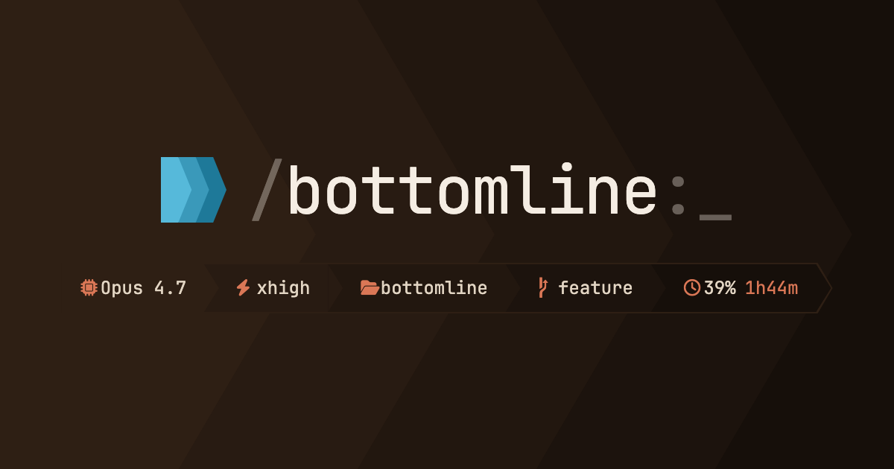

# Bottomline

[](https://bottomline.sh) [](https://github.com/giorgiostokje/bottomline/actions/workflows/tests.yml)



Modular, project-aware status line for Claude Code. Bottomline renders one or more colour-coded **bars** below every response — together they form your **status line**. The built-in bar surfaces model, context, tokens, cost and more; stack on language, git, and custom bars to build the status line that fits your workflow.

---

## Features

### Modular
Add, remove, and reorder bars freely. Each bar is a standalone shell script or inline JSON definition — mix built-in bars with your own.

- **19 built-in bars** — 17 language and ecosystem bars (PHP, JavaScript, Go, Shell, Python, Rust, Ruby, Java, Swift, Elixir, Salesforce, C/C++, Dart, .NET, Kotlin, Lua, Git) plus opt-in Linear (project management) and `random-facts`
- **Built-in status bar** — model, effort, context usage, directory, git branch, token counts, rate limits, cost
- **Custom bars** — write any bar as a shell script; place it in `.claude/bottomline/bars/` and reference it by name

### Themeable
Control every colour from a single config file, or drop in a named theme in one line.

- **Gradient backgrounds** — linear RGB interpolation across any number of keyframes
- **22 included themes** — Catppuccin, Dracula, Tokyo Night, Nord, Gruvbox, Rosé Pine, Solarized, One Dark, GitHub, Everforest, Monokai and more
- **Nerd Font, emoji, or text-only icons** — per-segment icon overrides supported

### Project-aware
Bottomline detects your project's ecosystem and activates the right bars automatically — no manual configuration per project.

- **Auto-bars** — bars activate when a signal file (e.g. `composer.json`, `go.mod`, `Cargo.toml`) is found in the project root
- **Per-project config** — place `.claude/bottomline.json` in any project to override colours, segments, or bars for that project only
- **Three-layer config merge** — shipped defaults → user overrides → project overrides, deep-merged at runtime

### Agent skills
Five Claude Code skills for installing, configuring, debugging, and extending Bottomline — no manual file editing required.

- `/bottomline:setup` — install and wire the status line
- `/bottomline:configure` — change colours, icons, segments, themes, and bars
- `/bottomline:debug` — diagnose blank output or missing bars
- `/bottomline:create-bar` — scaffold a new bar script
- `/bottomline:create-theme` — design or extract a named colour theme

---

## Prerequisites

| Requirement | Notes |
|---|---|
| **Bash ≥ 3.2** | macOS ships Bash 3.2, which meets this requirement |
| **jq** | `brew install jq` / `apt install jq` / [jqlang.github.io/jq](https://jqlang.github.io/jq/download/) |
| **Nerd Font** (optional) | Required for `"icons": { "type": "nerd" }` (the default). Download from [nerdfonts.com](https://www.nerdfonts.com/font-downloads), install, and **set it as your terminal's font**. Switch to `"emoji"` or `"none"` if you don't want one. |

---

## Installation

### Via Claude Code plugin system (recommended)

Add this repo as a marketplace source, then install the plugin:

```
/plugin marketplace add giorgiostokje/bottomline
/plugin install bottomline@bottomline
```

Once installed, run the setup skill to wire the status line:

```
/bottomline:setup
```

### Manual clone

**1. Clone the repository:**

```bash
git clone https://github.com/giorgiostokje/bottomline ~/.claude/bottomline
```

**2. Add the `statusLine` block to `~/.claude/settings.json`:**

```json
{
  "statusLine": {
    "type": "command",
    "command": "~/.claude/bottomline/bottomline.sh",
    "refreshInterval": 60
  }
}
```

If a `statusLine` key already exists, update its `command` value in place.

**3. Create `~/.claude/bottomline.json`** (your user config file):

```json
{}
```

This is where your personal colour, icon, and segment preferences live. Start with an empty object and add keys as needed.

**4. Verify:**

```bash
echo '{}' | bash ~/.claude/bottomline/bottomline.sh
```

You should see one line of ANSI status line output. If you see nothing, run `/bottomline:debug`.

### Uninstalling

Remove the `statusLine` block from `~/.claude/settings.json`, or restore its `command` value to whatever it pointed to before.

---

## Skills

Bottomline ships five Claude Code skills. Invoke them with `/` in any Claude Code session.

| Skill | Purpose |
|---|---|
| `/bottomline:setup` | Install, verify prerequisites, wire `statusLine.command` |
| `/bottomline:configure` | Change colours, icons, segments, themes, bars — guided or direct |
| `/bottomline:debug` | Diagnose blank output, missing bars, icon boxes, config errors |
| `/bottomline:create-bar` | Write a new project-specific bar script |
| `/bottomline:create-theme` | Design or extract a named colour theme |

---

## Configuration

### TL;DR

Drop this in `~/.claude/bottomline.json` to get going with sensible defaults:

```json
{
  "auto_bars": {
    "enabled": true,
    "disabled": ["git"]
  },
  "segments": {
    "effort": {
      "xhigh": { "color": "warning", "icon": { "nerd": "f071", "emoji": "26a0" } },
      "max":   { "color": "danger",  "icon": { "nerd": "f05e", "emoji": "1f6d1" } }
    },
    "context": {
      "200000": { "color": "warning", "icon": { "nerd": "f071", "emoji": "26a0" } },
      "300000": { "color": "danger",  "icon": { "nerd": "f05e", "emoji": "1f6d1" } }
    },
    "git_branch": {
      "main": { "color": "danger", "icon": { "nerd": "f05e", "emoji": "1f6d1" } }
    },
    "usage": {
      "75": { "color": "warning" },
      "90": { "color": "danger" }
    }
  }
}
```


---

### Config file locations

Three files are **deep-merged** at runtime, highest priority first:

| Priority | Path | Purpose |
|---|---|---|
| 1 (highest) | `<project>/.claude/bottomline.json` | Project overrides |
| 2 | `~/.claude/bottomline.json` | User overrides |
| 3 (lowest) | `<plugin-dir>/settings.json` | Shipped defaults — do not edit |

`<plugin-dir>` is the root of the Bottomline installation. For marketplace installs it is `~/.claude/plugins/marketplaces/bottomline`; for a manual clone to the default location it is `~/.claude/bottomline`.

Objects are merged recursively; arrays and scalars take the highest-priority non-null value. **Exception:** non-empty arrays whose elements are objects with a `script` field are merged by `script` key — matched entries are deep-merged (higher-priority wins on conflicts), unmatched entries from either layer survive; an empty array still wins outright. `segments.disabled` and `auto_bars.disabled` are unioned across all three levels rather than overridden.

---

### Colors & Theming

Set colours under `appearance.colors`. All values are `#rrggbb` hex strings.

| Key | Default | Description |
|---|---|---|
| `text` | `#e2d5c3` | Primary text colour |
| `accent` | `#da7756` | Icon and highlight colour |
| `warning` | `#f4a261` | Warning threshold colour |
| `danger` | `#e05a4e` | Critical threshold colour |
| `background` | `["#2e1f14","#160f0a"]` | Hex string (flat) or array of hex keyframes (gradient) |

`background` accepts any number of keyframe stops; the gradient is interpolated in linear RGB so the first keyframe always falls on the first segment and the last on the last.

#### Themes

A theme is a named JSON file in `<plugin-dir>/themes/` that overrides colour settings. Set `"appearance": { "theme": "catppuccin-mocha" }` at any config level. Theme colours are applied *after* the three-layer merge, so they win over any `appearance.colors` values. Set `"theme": ""` at project level to disable a user-level theme. Use `/bottomline:create-theme` to create a new one.

#### Included themes

| Theme | Background | Description |
|---|---|---|
| `claude` | Dark brown gradient | Matches Claude's brand orange tones (the default palette) |
| `clarice` | Dark brown gradient | Claude's warm tones with a cooler blue accent |
| `claire` | Dark navy gradient | Cool dark teal — low-contrast complement to `clarice` |
| `catppuccin-mocha` | Dark blue-grey gradient | [Catppuccin](https://github.com/catppuccin/catppuccin) Mocha — dark lavender |
| `catppuccin-latte` | Light grey gradient | Catppuccin Latte — light mode |
| `dracula` | Dark charcoal gradient | [Dracula](https://draculatheme.com/) — dark with purple accent |
| `everforest-dark` | Dark green-grey gradient | [Everforest](https://github.com/sainnhe/everforest) dark — muted forest greens |
| `everforest-light` | Light warm gradient | Everforest light mode |
| `github-dark` | Dark slate gradient | [GitHub](https://github.com/) dark — blue accent on near-black |
| `github-light` | Light grey gradient | GitHub light mode |
| `gruvbox-dark` | Dark brown gradient | [Gruvbox](https://github.com/morhetz/gruvbox) dark — retro teal accent |
| `gruvbox-light` | Light tan gradient | Gruvbox light mode |
| `monokai` | Dark charcoal gradient | [Monokai](https://monokai.pro/) — green accent on near-black |
| `nord` | Dark blue-grey gradient | [Nord](https://www.nordtheme.com/) — icy blues on dark slate |
| `one-dark` | Dark grey gradient | [One Dark](https://github.com/atom/one-dark-ui) — blue accent |
| `one-light` | Light grey gradient | One Light — light mode |
| `rose-pine` | Dark purple gradient | [Rosé Pine](https://rosepinetheme.com/) — lavender on deep purple |
| `rose-pine-dawn` | Light warm gradient | Rosé Pine Dawn — light mode |
| `solarized-dark` | Dark teal gradient | [Solarized](https://ethanschoonover.com/solarized/) dark |
| `solarized-light` | Light yellow gradient | Solarized light mode |
| `tokyo-night` | Dark blue-purple gradient | [Tokyo Night](https://github.com/enkia/tokyo-night-vscode-theme) — blue on deep navy |
| `tokyo-night-day` | Light blue gradient | Tokyo Night Day — light mode |

---

### Icons

```json
{
  "appearance": {
    "icons": {
      "type": "nerd",
      "overrides": {
        "model": "e7a2",
        "git_branch": "e0a0"
      }
    }
  }
}
```

| Key | Values | Description |
|---|---|---|
| `type` | `nerd` \| `emoji` \| `none` | Icon set to use |
| `overrides` | `{ "<segment>": "<codepoint>" }` | Per-segment icon override — 4–5 hex digits (e.g. `"e0b4"`) or a literal glyph |

Override keys are segment names (`model`, `effort`, `context`, `directory`, `git_branch`, `tokens_in`, `tokens_out`, `usage_5h`, `usage_7d`, `cost`) plus `warn` and `danger` (cross-segment indicators). A shared `tokens` key overrides both `tokens_in` and `tokens_out`; a specific key wins.

---

### Segments

#### Enabled segments

Control which segments are shown and in what order:

```json
{
  "segments": {
    "enabled": ["model", "effort", "context", "directory", "git_branch", "tokens_in", "tokens_out", "usage_5h", "usage_7d", "cost"]
  }
}
```

Available segment names:

| Segment | Shows |
|---|---|
| `model` | Active Claude model name |
| `effort` | Current effort level with configurable per-level colour and icon |
| `context` | Context window fill gauge + `used/total` in thousands |
| `directory` | Current project directory name (clickable link in supporting terminals) |
| `git_branch` | Current git branch (clickable link to remote on GitHub/GitLab/Bitbucket) |
| `tokens_in` | Freshly processed input tokens (uncached + cache-write) for the session, with cache-read hits shown as a `+` suffix |
| `tokens_out` | Output tokens for the session |
| `usage_5h` | 5-hour rate limit percentage + time until reset |
| `usage_7d` | 7-day rate limit percentage + time until reset |
| `cost` | Estimated session cost (Sonnet/Opus/Haiku pricing) |

#### Disabling segments

`disabled` is unioned across all config levels — a project can suppress a segment without re-listing the user's disabled set:

```json
{ "segments": { "disabled": ["cost", "tokens_in", "tokens_out"] } }
```

#### Separator

Override the separator glyph with a 4–5 hex codepoint string or a literal character:

```json
{ "segments": { "separator": "e0b0" } }
```

#### Per-segment settings

- **`segments.effort`** — `{ "level": { "color", "icon" } }` — valid levels: `low`, `medium`, `high`, `xhigh`, `max`
- **`segments.context`** — `{ "token_threshold": { "color", "icon" } }` — quoted integer keys (e.g. `"200000"`)
- **`segments.git_branch`** — `{ "branch_name": { "color", "icon" } }` — exact branch name match
- **`segments.usage`** — `{ "percentage": { "color" } }` — quoted integer keys (e.g. `"75"`)

`color` accepts a named reference (`text`, `accent`, `warning`, `danger`) or a `#rrggbb` hex string. `icon` accepts `{ "nerd": "codepoint", "emoji": "codepoint" }`.

---

### Bars

A bar is an additional line rendered below the main status line. Bars are defined in the `bars` array. Each entry is either a **script bar** (runs a shell script) or an **inline segment bar** (defined entirely in JSON).

#### Script bars

```json
{
  "bars": [
    { "script": "git" },
    { "script": "php", "colors": "inherit" },
    { "script": "~/my-scripts/custom.sh" }
  ]
}
```

`script` is a bare name (resolved from `<project>/.claude/bottomline/bars/<name>.sh` first, then `<plugin-dir>/bars/<name>.sh`) or a path with `/` (supports `~` expansion).

#### Inline segment bars

Define a bar's segments directly in JSON without writing a shell script. Each segment object in the `segments` array supports:

| Key | Description |
|---|---|
| `content` | Static text string |
| `file` | Path to a file — renders its contents as text |
| `script` | Bar script name or path — runs it and captures stdout |
| `icon` | Named icon string, a 4–5 hex codepoint, or a per-type object `{ "nerd": "...", "emoji": "..." }` |
| `colors.text` | Foreground text colour — hex or named (`text`, `accent`, `warning`, `danger`) |
| `colors.accent` | Foreground accent colour |
| `ansi` | `true` to pass `content` / `file` / `script` output through as raw ANSI (default: false) |

#### Bar colors

Each bar entry accepts an optional `colors` block that controls the colours passed to its script:

```json
{ "script": "git", "colors": { "text": "#f0ddd8", "accent": "#f05033", "background": ["#1a0c08","#2e1610"] } }
```

`colors` accepts:

| Value | Behaviour |
|---|---|
| Object `{ "text", "accent", "warning", "danger", "background" }` | Overrides individual colour values; any key may be omitted |
| `"inherit"` | Explicitly use the merged config colours; suppresses the bar's built-in language palette |
| Absent | Bar script can apply its own built-in language palette |

`background` accepts a hex string or keyframe array. Named colour values (`text`, `accent`, `warning`, `danger`) resolve to the current merged config colours.

---

### Auto-bars

Auto-bars are bars that appear automatically when a signal file (e.g. `go.mod`, `composer.json`) is found in the project root.

Enable auto-bar detection at user or project level:

```json
{ "auto_bars": { "enabled": true } }
```

Auto-bars are disabled by default (`enabled: false` in `settings.json`).

#### Disabling specific bars

`auto_bars.disabled` is **unioned** across all config levels, so a project config can add exclusions without overwriting the user's:

```json
{ "auto_bars": { "disabled": ["java", "javascript"] } }
```

#### Cache

Auto-detected bars cache output in `/tmp`. `auto_bars.refresh_minutes` sets the global TTL (default: `5`). Override per bar by adding a matching entry to `auto_bars.scripts` at user or project level — e.g. `{"auto_bars":{"scripts":[{"script":"git","refresh_minutes":1}]}}`. The `git` bar defaults to `0` (live). Set `auto_bars.inherit_colors: true` to make all auto-detected bars use the merged config palette instead of their built-in language colours.

#### Registered signal files

The `auto_bars.scripts` array maps bar names to the signal files that trigger them. The full list is defined in the plugin's `settings.json`. All 17 language and ecosystem bars are auto-detectable; `random-facts` and `linear` have no auto-detection signal and must be added explicitly via `bars`.

---

### Included bars

#### `git` — Git enrichment

**Signal:** `.git`

Segments: current branch (or detached HEAD / tag), linked worktree name, dirty/clean status with `+lines -lines`, stash count, ahead/behind tracking branch, last commit author and age.

#### `php` — PHP ecosystem

**Signal:** `composer.json`

PHP runtime version, then packages from `composer.lock`: frameworks (Laravel, Lumen, Symfony, CakePHP, Slim), Laravel stack add-ons (Octane, Boost, Reverb, Livewire, Flux, Inertia with frontend detection), Filament, and Laravel Herd `.test` URL (clickable). Built-in palette: purple tones.

#### `javascript` — JavaScript / Node.js ecosystem

**Signal:** `package.json`

Installed versions from `node_modules` for: Next.js, React, Remix, Expo, React Native, Nuxt, Vue, SvelteKit, Svelte, Angular, Astro, Electron, Vite (suppressed when implied by meta-framework), SolidJS, Preact, Fastify, NestJS, Express, Hono, TypeScript. Built-in palette: yellow tones.

#### `go` — Go ecosystem

**Signal:** `go.mod` — Go version, workspace flag when `go.work` is present. Built-in palette: cyan tones.

#### `shell` — Shell / Bash ecosystem

**Signal:** `.shellcheckrc` (also activates when any `.sh` file exists at the project root)

Target shell (reads `shell=` from `.shellcheckrc`; defaults to `bash`), running Bash version, ShellCheck version when on `PATH`. Built-in palette: green tones.

#### `python` — Python ecosystem

**Signal:** `pyproject.toml`, `requirements.txt`, `Pipfile`, `setup.py`

Python runtime, package manager (uv/Poetry/PDM/Hatch/Pipenv), detected framework with version (Django, FastAPI, or Flask). Built-in palette: yellow accent on dark blue.

#### `rust` — Rust ecosystem

**Signal:** `Cargo.toml` — Rust, edition, workspace flag. Built-in palette: orange-red tones.

#### `ruby` — Ruby ecosystem

**Signal:** `Gemfile` — Ruby version, framework from `Gemfile.lock` (Rails, Sinatra, Hanami). Built-in palette: red tones.

#### `java` — Java ecosystem

**Signal:** `pom.xml`, `build.gradle`, `build.gradle.kts`

Build tool (Maven or Gradle) with Java version, framework (Spring Boot, Quarkus, Micronaut) with version. Built-in palette: orange tones.

#### `swift` — Swift ecosystem

**Signal:** `Package.swift` — Swift tools version, Vapor version from `Package.resolved`. Built-in palette: red-orange tones.

#### `elixir` — Elixir ecosystem

**Signal:** `mix.exs` — Elixir version, Phoenix version from `mix.lock`. Built-in palette: purple tones.

#### `salesforce` — Salesforce ecosystem

**Signal:** `sfdx-project.json`

SF CLI version, default target org with sandbox indicator, source API version, and namespace. Org resolved from project `.sf/config.json` → project `.sfdx/sfdx-config.json` → global `~/.sf/config.json`. Built-in palette: Salesforce Lightning cloud blue.

#### `c-cpp` — C / C++ ecosystem

**Signal:** `CMakeLists.txt`, `meson.build`, `configure.ac`

Language variant (C, C++, or C/C++) with C++ standard, build system (CMake, Meson, or Autotools), package managers (Conan, vcpkg), testing framework (GoogleTest, Catch2, doctest, Boost.Test, CTest), static analysis/formatting (clang-tidy, cppcheck, clang-format). Built-in palette: steel blue tones.

#### `dart` — Dart / Flutter ecosystem

**Signal:** `pubspec.yaml`

Dart SDK constraint and package name, Flutter indicator, testing (`flutter_test` suppresses `test`), lint package (very_good_analysis, flutter_lints, lints), state management (Riverpod, BLoC, Provider), Dio HTTP client. Built-in palette: Dart brand blue.

#### `dotnet` — .NET ecosystem

**Signal:** `global.json`, `Directory.Build.props`, `Directory.Build.targets`, `*.csproj`, `*.sln`

.NET SDK version, target framework, framework (Blazor, ASP.NET Core, MAUI), testing (xUnit, NUnit, MSTest), static analysis (StyleCop, SonarAnalyzer), EF Core ORM. Built-in palette: .NET brand purple.

#### `kotlin` — Kotlin ecosystem

**Signal:** `build.gradle.kts` (must reference the Kotlin plugin)

Kotlin version, Gradle wrapper version, framework (Ktor or Spring Boot), testing (Kotest suppresses JUnit 5), MockK, static analysis (Detekt, ktlint). Built-in palette: Kotlin purple.

#### `linear` — Linear project management

No auto-detection signal — configure via `/bottomline:configure`. Requires a personal API key (Linear → Settings → API → Personal API keys) and a team key from your workspace URL. Store the key in `~/.linear_api_key` to keep it out of JSON config. Config splits across two levels:

**User level** (`~/.claude/bottomline.json`) — `api_key` only:
```json
{ "bars": [{ "script": "linear", "params": { "api_key": "file:~/.linear_api_key" } }] }
```

**Project level** (`.claude/bottomline.json`) — `team` and refresh interval:
```json
{ "bars": [{ "script": "linear", "refresh_minutes": 15, "params": { "team": "ENG" } }] }
```

Default segments: `cycle` (sprint name and progress), `in_progress`, `review`, `assigned`. Opt-in via `params.segments`: `priority`, `overdue`, `due_soon` (configurable via `params.due_soon_days`, default 3), `cycle_days`, `blocked`, `mentions`. Falls back to stale cached data when offline.

#### `lua` — Lua ecosystem

**Signal:** `.luarc.json`, `.luarc.jsonc`, `.lua-version`, `*.rockspec`

Lua version (from `.lua-version`, `.luarc.json`, or the `lua` binary), LuaRocks, framework (LÖVE, OpenResty, Lapis), testing (Busted suppresses LuaUnit), static analysis/formatting (Luacheck, StyLua). Built-in palette: steel blue tones.

#### `random-facts`

No auto-detection signal — add explicitly via `bars`:

```json
{ "bars": [{ "script": "random-facts", "refresh_minutes": 60 }] }
```

Fetches a random fact from the [Useless Facts API](https://uselessfacts.jsph.pl), cached for `refresh_minutes` minutes (default: 60). Falls back to 10 built-in offline facts. Uses the bar's `colors` config or merged config defaults — no built-in palette.

---

### Complete settings reference

All keys, their types, and which config files they belong in.

| Key | Type | Description |
|---|---|---|
| `appearance.theme` | `string` | Name of a theme file in `<plugin-dir>/themes/`. Overrides all colour settings. |
| `appearance.colors.text` | `#rrggbb` | Primary text colour |
| `appearance.colors.accent` | `#rrggbb` | Icon and highlight colour |
| `appearance.colors.warning` | `#rrggbb` | Warning threshold colour |
| `appearance.colors.danger` | `#rrggbb` | Critical/danger threshold colour |
| `appearance.colors.background` | `#rrggbb` or `["#hex", ...]` | Flat colour or gradient keyframes |
| `appearance.icons.type` | `nerd` \| `emoji` \| `none` | Icon set |
| `appearance.icons.overrides` | `{ "name": "codepoint" }` | Per-segment icon overrides |
| `segments.enabled` | `string[]` | Ordered list of segments to render |
| `segments.disabled` | `string[]` | Segments to suppress (unioned across config levels) |
| `segments.separator` | `string` | Segment separator — 4–5 hex codepoint or literal glyph |
| `segments.effort` | `{ "level": { "color", "icon" } }` | Per-effort-level colour and icon |
| `segments.context` | `{ "threshold": { "color", "icon" } }` | Token-count thresholds → colour/icon |
| `segments.git_branch` | `{ "branch": { "color", "icon" } }` | Per-branch-name colour and icon |
| `segments.usage` | `{ "threshold": { "color" } }` | Usage percentage thresholds → colour |
| `bars` | `array` | Explicit bar list — appended after auto-detected bars |
| `bars[].script` | `string` | Bar script name or path |
| `bars[].segments` | `array` | Inline segment bar (array of segment objects); or, for script bars, a JSON array of segment-name strings passed to the script as `BOTTOMLINE_BAR_SEGMENTS` |
| `bars[].colors` | object \| `"inherit"` | Bar colour overrides — object with any of `text`, `accent`, `warning`, `danger`, `background`; or `"inherit"` to use merged config colours and suppress the bar's built-in palette |
| `bars[].refresh_minutes` | `integer` | Cache TTL in minutes for script bars that use `bl_cache_write`. All 17 built-in language and ecosystem bars respect this. `random-facts` also respects this (default: 60). `0` disables caching. For auto-detected bars, defaults to `auto_bars.refresh_minutes` unless overridden. |
| `bars[].params` | `object` | Arbitrary key-value pairs passed to the bar script as `BOTTOMLINE_BAR_PARAMS` (JSON). String values support `$ENV_VAR` expansion and `file:<path>` resolution. Required by the `linear` bar (`api_key`, `team`). |
| `auto_bars.enabled` | `boolean` | Enable auto-bar detection for this config level (default: `false`) |
| `auto_bars.disabled` | `string[]` | Bar names to exclude from auto-detection (unioned across config levels) |
| `auto_bars.inherit_colors` | `boolean` | When `true`, all auto-detected bars behave as `colors: "inherit"` |
| `auto_bars.scripts` | `array` | Registry of `{ "script", "signals" }` entries — defined by the plugin; do not edit |
| `auto_bars.refresh_minutes` | `integer` | Global cache TTL in minutes for all auto-detected bars. `0` disables caching. Default: `5`. |
| `auto_bars.scripts[].refresh_minutes` | `integer` | Per-entry TTL default. Override at user/project level by adding a matching entry to `auto_bars.scripts`. |

**Color value formats** (anywhere a colour is accepted):

| Format | Example | Description |
|---|---|---|
| Hex string | `"#da7756"` | Direct `#rrggbb` colour |
| Named reference | `"accent"` | Resolves to the merged config value for `text`, `accent`, `warning`, or `danger` |

---

## Writing a custom bar

Bar scripts are standalone Bash files that write ANSI segments to stdout using the `bl_bar_init`, `bl_seg`, and `bl_bar_finish` helpers.

**Template:**

```bash
#!/usr/bin/env bash
# Bottomline bar: <description>

PROJ="${BOTTOMLINE_PROJECT_DIR:-}"
[[ -z "$PROJ" ]] && exit 0
# Add signal file guards:
# [[ ! -f "$PROJ/my-signal-file" ]] && exit 0

# shellcheck source=lib/helpers.sh
source "$BOTTOMLINE_LIB/helpers.sh"

# Handles cache check, palette fallback, and gradient resolution.
# Pass fallback text/accent/background colours for a built-in brand palette.
bl_bar_init mybar "#e2d5c3" "#da7756" '["#2e1f14","#160f0a"]'

# ── Icons ─────────────────────────────────────────────────────────────────────
bl_icon_set IC_EXAMPLE $'\xef\x80\x80' '🔥'   # replace with your Nerd Font codepoint

# ── Segments ──────────────────────────────────────────────────────────────────
# bl_seg icon label [version] [state]                        — icon/label/version
# bl_data_seg icon primary [qualifier] [state] [bullet] [suffix]  — two-element data segments
my_value="hello"
[[ -n "$my_value" ]] && bl_seg "$IC_EXAMPLE" "$my_value"

bl_bar_finish "$_bar_gradient"
```

**Placement:** save to `<project>/.claude/bottomline/bars/<name>.sh`, then reference by name in `<project>/.claude/bottomline.json`:

```json
{ "bars": [{ "script": "mybar" }] }
```

See `/bottomline:create-bar` for the full guide, available environment variables, and testing commands.

---

## Testing

The test suite uses [bats-core](https://github.com/bats-core/bats-core) (`brew install bats-core`), run from the plugin root:

```bash
bats --recursive tests/          # all tests
bats tests/unit/                 # unit tests (fmt_n, decode_icon)
bats tests/integration/          # main pipeline (segments, config, themes)
bats --recursive tests/integration/bars/  # all bar tests
```

`tests/unit/` covers pure utility functions. `tests/integration/` covers the main status line and all 19 bars, with shared fixture files under `tests/integration/bars/fixtures/`.

### Linting

[ShellCheck](https://www.shellcheck.net/) (`brew install shellcheck` / `apt install shellcheck`) lints the main script, all library files, and every bar script:

```bash
shellcheck bottomline.sh lib/*.sh bars/*.sh
```

Configuration lives in `.shellcheckrc` at the project root. It sets `shell=bash`, allows `source` directives to be resolved from the project root (`source-path=.`), and disables SC1003 (a false positive on OSC terminal escape sequences used in ANSI output).

---

## Contributing

Contributions welcome — bug reports, new bars, new themes, and improvements to existing scripts. New bars should follow the template in "Writing a custom bar" and the structure of an existing bar (e.g. `bars/go.sh`). New themes go in `themes/` — see `skills/create-theme/SKILL.md` for the schema.

**Bug reports** — include:

```bash
BL_DIR="$HOME/.claude/bottomline"   # or marketplace path
echo '{}' | bash "$BL_DIR/bottomline.sh"
jq '.' "$BL_DIR/settings.json"
jq '.' ~/.claude/bottomline.json 2>/dev/null
bash --version | head -1 && jq --version
```

---

## Credits

Built for [Claude Code](https://claude.ai/code). Catppuccin themes from the [Catppuccin](https://github.com/catppuccin/catppuccin) project (MIT). Random facts from the [Useless Facts API](https://uselessfacts.jsph.pl) by [lukePeavey](https://github.com/lukePeavey/useless-facts). Nerd Font codepoints from [Nerd Fonts](https://www.nerdfonts.com/) (MIT).
